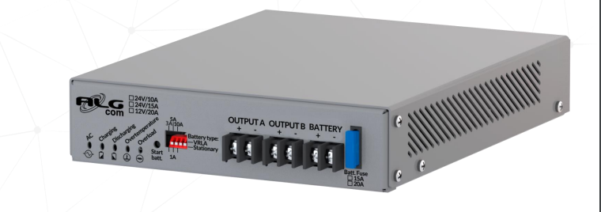

# Infrastructura física

### Seleccion de la tecnología a emplear:

Se estudiaron 3 opciones : GSM/LTE, SigFox y Lora. 

Se observó que a nivel general la zona no posee una buena cobertura GSM/LTE(se adjuntan los documentos correspondientes obtenidos del link https://www.nperf.com/). 

Por lo cual se descarta utilizar GSM/LTE.

Para seleccionar entre Lora y SigFox se presenta la siguiente tabla:

|                         | SigFox                | Lora             |    
|:-----------------------:|:---------------------:|:----------------:|
| Ancho de banda          | 100 Hz                | 250 Khz          |
| Bidireccional?          | Limitado/half duplex  | Si/half duplex   |  
| Maximos mensajes (p/dia)|  140                  |Ilimitado        |    
| Longitud carga útil     | Max 12 bytes          | Max 243 bytes    |
| Alcance                 | 10km Urbano 40km rural| 5K Urbano 20Km rural |  
| Autenticación/cifrado   | NO   | SI
| Consumo bateria al Tx   |~230mA,3.3V=>0.759W(**) | 0.633W(***)
| precio chip/nodo        | 6.94 (****)AX-SFE-1-01-TX30 | 13.91 (*****) LR1120IMLTRT

(** )https://development.libelium.com/sigfox_networking_guide/hardware

(*** )http://www.multitech.net/developer/products/multiconnect-conduit-platform/accessory-cards/mtac-lora/mtac-lora-power-draw/

(**** )https://ar.mouser.com/ProductDetail/onsemi/AX-SFEU-1-01-TX30?qs=tCMd4XlZ%2FiDiekwIKrlBBw%3D%3D

(***** )https://ar.mouser.com/ProductDetail/Semtech/LR1120IMLTRT?qs=MyNHzdoqoQKzng%252BALV%2FZpQ%3D%3D

Aún cuando ambas tecnologías son buenas candidatas, el hecho de que sigfox tenga una carga útil de 12 bytes inclina la balanza a utilizar Lora.

Dentro de las bandas en que puede ser utilizado Lora, se selecciona la correspondiente a 915Mhz ya que se encuentra dentro de las bandas no "Licenciadas" según la RESOL-2019-4653-APN-ENACOM#JGM

## Capa de percepción:
---
Para seleccionar los nodos sensores se parte de la premisa que deben poder utilizarse en el territorio nacional y que sean de bajo costo.
Para utilizarse los mismos deben estar inscriptos en el RAMATEL, o en su defecto poderse inscribir(se deberá realizar los ensayos correspondientes en un laboratorio y luego hacer la presentación en Enacom). Generalmente, si un dispositivo cumple con normas FCC el ensayo de laboratorio es un mero trámite ya que se corrobora su funcionamiento. Para la importación/comercialización del mismo en el territorio nacional, la firma importadora debe estar inscripta también en el organismo con un representante Técnico y un representante legal. El representante técnico es quien gestiona en Enacom el proceso.
Una vez finalizado, se entrega un nro de aprobación que debe estar impreso en el dispositivo y sea legible. La validez del certificado de aprobación es de 3 años.

La lista de laboratorios acreditados para realizar los ensayos se puede obtener de : https://www.enacom.gob.ar/laboratorios-acreditados_p349

Mientras que el representante técnico se puede generar desde el sistema Hertz. 

Otro punto muy importante a considerar, es que la mayoría de estos equipos poseen baterías internas... las cuales tienen consideraciones especiales al importar.

* Opción 1: 

Marca: TekTelic (Canada)

Modelo: T0005982

Precio: 136.4 USD FOB (4/8/2022)

Distribuidor(link): https://www.digikey.com

Bateria: 10 años

Proteccion: ip67

Temperatura de operacion: -40ºC a 65ºC

Parámetros Lora: 

                 RF Power: 23 dBm       
                 RF Sensitivity: -137 dBm
                 Bandas : todas las bandas globales
                 Lora device Class: Class (A)
                 Normativas: FCC 15.247 RSS-247 y FCC 15.209 RSS-Gen

* Opción 2:

Marca: Milesight

Modelo: EM500-SMTC

Precio: 630 eur FOB

Distribuidor(link): https://www.reichelt.com/

Bateria: 4-10 años

Protección: ip66

Temperatura de operacion: -30ºC + 70ºC

Parámetros Lora:
                
                RF Power: 20dBm
                RF Sensitivity: -147 dBm
                Frecuency: US915
                Lora device Class: Class (A)
                FCC: aprobado(documentación adjunta)

* Opción 3: (*) mide temperatura del suelo no del ambiente por lo que se desecha

Marca: Seeed Technology

Modelo: 101990565 (LoRa-S-470/868/915-Soil MT-01)

Precio: 219 USD FOB

Distribuidor(link):  https://www.digikey.com

Bateria: como mínimo 3A

Protección: ip66- ip65

Temperatura de operación: -40 ºC - 85ºC

Parámetros Lora: 

                RF power: 16 dBm
                RF sensitivity: -136.5 dBm
                Frecuency: 915Mhz
                FCC: aprobado(documentación adjunta)

De las 3 opciones presentadas se selecciona la primera. Cabe mencionar que en la opción 3 se presenta la información de la resistencia UV del gabinete... importante si se ubicasen en lugares sin cobertura.
Por otra parte, lo bueno de la primera opción es que directamente se coloca en el suelo por lo que no hay que realizar ninguna obra.

## Capa de red:
---
### Selección del gateway:

* Opción 1: Indoor

Sistema ya homologado que es comercializado por la firma SEMAK ( fabricante: Multitech , MTCDT-L4N1-246A-915-US
) cuyo costo es de 812 usd FOB en Mouser(https://ar.mouser.com/)(En Semak por razones de publico conocimiento no se publican precios). Permite conectarse a TTN.

Parámetros Lora:

Frecuencia: 915 MHz

Capacidad del canal: 8 canales half duplex

Potencia de salida: 27 dBm máximo antes de la antena

Alimentación : 9~32VDC 1.7A =15W 

Conexionado: puerto ethernet

* Opción 2: Indoor

Sistema no homologado. Comercializado en AMAZON y ALIEXPRESS(fabricante ). Costo: 150 USD(FOB) (https://es.aliexpress.com/)

Parámetros Lora:

Frecuencia: 915 MHz(banda 1)

Potencia de salida: 20 dBm máximo antes de la antena

Alimentación : 9~24VDC 

Conexionado: puerto ethernet

### Alimentación del gateway:

Se selecciona una UPS 24 Algcom NOBREAK FN:Algcom Fuente Ups 24v 10a -no Break-(no Powerteh-no Gralf)

 

Precio: 68.291 pesos = 507.34 USD

(https://articulo.mercadolibre.com.ar/MLA-1131812198-algcom-fuente-ups-24v-10a-no-break-no-powerteh-no-gralf-_JM#position=6&search_layout=stack&type=item&tracking_id=714c2a11-9695-423e-ad56-8ad536c78eee ) (consultado 4/8/2022)

### Selección del protecciones:

Para la selección se busca en proveedores nacionales como ser Elemon, Semak, Electrocomponentes.

Código: ACCIOT-RSP01  
Fabricante: CITEL
Distribuidor: Elemon 
Cod Distribuidor: KLK02900
Precio: 185.38 USD (4/8/2022)

Características:
Return loss: >20dB
Insertion loss: <0.2db
Rango de frecuencia: 800- 2200 Mhz
Impedancia: 50
Maxima corriente de descarga: 50kA
Protección: ip65

### Selección de antena:

Para la selección se busca en proveedores nacionales como ser Elemon, Semak, Electrocomponentes.

Código: ACCIOT-KAN02
Fabricante: Kerlink\
Distribuidor: ELEMON
Precio: 306.3 USD

Características:   
Ganancia Máxima: 6dBi \
Resistencia al viento: 150MPH

### Elevación de la antena:

Los modelos de cobertura se analizaron suponiendo una altura de 15 mts sobre la superficie, por lo que se propone utilizar un monoposte.

Para estimar el costo de una estructura de estas características se consulta al trabajo "Plan de negocios para la instalacion de torres de comunicaciones" de Mariano Alexis Orpella(Marzo 2022)(https://repositorio.uca.edu.ar/bitstream/123456789/13812/1/plan-negocio-instalaci%C3%B3n-torres.pdf) .

En el mismo, se presenta que un monoposte convencional de 30 mts cuesta 4.530.369,9 pesos argentinos, es decir 33658.1 usd aproximadamente.

Normativas aplicables, según ENACOM:\
 "La regulación referida a la obra civil de la estructura soporte de la antena, (mástiles / torres / anclajes / arriostramiento, etc.) no es competencia del ENACOM, por lo que no puede ejercer jurisdicción sobre la misma.  Tal situación queda determinada en los artículos 39, 40 y 41 de la Ley Nacional 19798/72, y en la Resolución Nº 795 CNT/92, ratificada por la Resolución 302 SC/99. Por lo tanto, los reclamos y consultas relacionados con la instalación, el deterioro o mal estado propios o relacionados con las estructuras soporte, deberán dirigirse a las municipalidades.

Cabe destacar que el titular de una estación en funcionamiento asume la responsabilidad de las obras e instalaciones accesorias que deban ejecutarse para instalar una estación radioeléctrica, atribuyéndose la responsabilidad técnica de una obra civil, al proyectista y al director de la misma, quedando encuadrada dicha situación en lo establecido en los artículos 1273 y siguientes del Código Civil y Comercial de la Nación"

### Pararrayos:

Se selecciona un pararrayos franklin 5 roscas: \
Código:PF512\
Marca: LPD\
Link: https://articulo.mercadolibre.com.ar/MLA-1147297255-pararrayos-franklin-5-puntas-rosca-12-_JM#position=1&search_layout=stack&type=item&tracking_id=91fef639-97d4-4bfe-85db-1fe6f76e1f8c

Costo: 8.900 pesos ~ 66 USD

