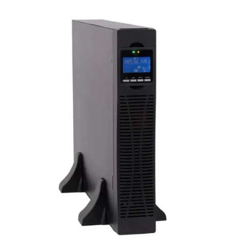

# Infrastructura física

### Seleccion de la tecnología a emplear:

Se estudiaron 3 opciones : GSM/LTE, SigFox y Lora. 

Se observó que a nivel general la zona no posee una buena cobertura GSM/LTE(se adjuntan los documentos correspondientes obtenidos del link https://www.nperf.com/). 

Por lo cual se descarta utilizar GSM/LTE.

Para seleccionar entre Lora y SigFox se presenta la siguiente tabla:

|                         | SigFox                | Lora             |    
|:-----------------------:|:---------------------:|:----------------:|
| Ancho de banda          | 100 Hz                | 250 Khz          |
| Bidireccional?          | Limitado/half duplex  | Si/half duplex   |  
| Maximos mensajes (p/dia)|  140                  |Ilimitado        |    
| Longitud carga útil     | Max 12 bytes          | Max 243 bytes    |
| Alcance                 | 10km Urbano 40km rural| 5K Urbano 20Km rural |  
| Autenticación/cifrado   | NO   | SI
| Consumo bateria al Tx   |~230mA,3.3V=>0.759W(**) | 0.633W(***)
| precio chip/nodo        | 6.94 (****)AX-SFE-1-01-TX30 | 13.91 (*****) LR1120IMLTRT

(** )https://development.libelium.com/sigfox_networking_guide/hardware

(*** )http://www.multitech.net/developer/products/multiconnect-conduit-platform/accessory-cards/mtac-lora/mtac-lora-power-draw/

(**** )https://ar.mouser.com/ProductDetail/onsemi/AX-SFEU-1-01-TX30?qs=tCMd4XlZ%2FiDiekwIKrlBBw%3D%3D

(***** )https://ar.mouser.com/ProductDetail/Semtech/LR1120IMLTRT?qs=MyNHzdoqoQKzng%252BALV%2FZpQ%3D%3D

Aún cuando ambas tecnologías son buenas candidatas, el hecho de que sigfox tenga una carga útil de 12 bytes inclina la balanza a utilizar Lora.

Dentro de las bandas en que puede ser utilizado Lora, se selecciona la correspondiente a 915Mhz ya que se encuentra dentro de las bandas no "Licenciadas" según la RESOL-2019-4653-APN-ENACOM#JGM

## Capa de percepción:
---
Para seleccionar los nodos sensores se parte de la premisa que deben poder utilizarse en el territorio nacional y que sean de bajo costo.
Para utilizarce los mismos deben estar inscriptos en el RAMATEL, o en su defecto poderse inscribir(se deberá realizar los ensayos correspondientes en un laboratorio y luego hacer la presentación en Enacom). Generalmente, si un dispositivo cumple con normas FCC el ensayo de laboratorio es un mero trámite ya que se corrobora su funcionamiento. Para la importación/comercialización del mismo en el territorio nacional, la firma importadora debe estar inscripta también en el organismo con un representante Técnico y un representante legal. El representante técnico es quien gestiona en Enacom el proceso.
Una vez finalizado, se entrega un nro de aprobación que debe estar impreso en el dispositivo y sea legible. La validez del certificado de aprobación es de 3 años.

La lista de laboratorios acreditados para realizar los ensayos se puede obtener de : https://www.enacom.gob.ar/laboratorios-acreditados_p349

Mientras que el representante técnico se puede generar desde el sistema Hertz. 

Otro punto muy importante a considerar, es que la mayoría de estos equipos poseen baterías internas... las cuales tienen consideraciones especiales al importar.

* Opción 1: 

Marca: TekTelic (Canada)

Modelo: T0005982

Precio: 136.4 USD FOB (4/8/2022)

Distribuidor(link): https://www.digikey.com

Bateria: 10 años

Proteccion: ip67

Temperatura de operacion: -40ºC a 65ºC

Parámetros Lora: 

                 RF Power: 23 dBm       
                 RF Sensitivity: -137 dBm
                 Bandas : todas las bandas globales
                 Lora device Class: Class (A)
                 Normativas: FCC 15.247 RSS-247 y FCC 15.209 RSS-Gen

* Opción 2:

Marca: Milesight

Modelo: EM500-SMTC

Precio: 630 eur FOB

Distribuidor(link): https://www.reichelt.com/

Bateria: 4-10 años

Protección: ip66

Temperatura de operacion: -30ºC + 70ºC

Parámetros Lora:
                
                RF Power: 20dBm
                RF Sensitivity: -147 dBm
                Frecuency: US915
                Lora device Class: Class (A)
                FCC: aprobado(documentación adjunta)

* Opción 3: (*) mide temperatura del suelo no del ambiente por lo que se desecha

Marca: Seeed Technology

Modelo: 101990565 (LoRa-S-470/868/915-Soil MT-01)

Precio: 219 USD FOB

Distribuidor(link):  https://www.digikey.com

Bateria: como mínimo 3A

Protección: ip66- ip65

Temperatura de operación: -40 ºC - 85ºC

Parámetros Lora: 

                RF power: 16 dBm
                RF sensitivity: -136.5 dBm
                Frecuency: 915Mhz
                FCC: aprobado(documentación adjunta)

De las 3 opciones presentadas se selecciona la primera. Cabe mencionar que en la opción 3 se presenta la información de la resistencia UV del gabinete... importante si se ubicasen en lugares sin cobertura.
Por otra parte, lo bueno de la primera opción es que directamente se coloca en el suelo por lo que no hay que realizar ninguna obra.

## Capa de red:
---
### Selección del gateway:

* Opción 1: Indoor
Sistema ya homologado que es comercializado por la firma SEMAK ( fabricante: Multitech , MTCDT-L4N1-246A-915-US
) cuyo costo es de 812 usd FOB en Mouser(https://ar.mouser.com/)(En Semak por razones de publico conocimiento no se publican precios).

Parámetros Lora:

Frecuencia: 915 MHz

Capacidad del canal: 8 canales half duplex

Potencia de salida: 27 dBm máximo antes de la antena

Alimentación : 9VDC 1.7A =15W 

Conexionado: puerto ethernet

### Alimentación del gateway:

Se selecciona una UPS monofásica Kaise:
Ups Online Monofasica Kaise 3kva 3000w Rack Tower Fp 1.0

Se deberá alimentar al sistema desde la linea de alimentación por lo que se necesita tramitar una boca correspondiente. En caso de falla de linea de alimentación y sin ninguna otra carga esta UPS alimentaría al gateway durante 3000w/15W~200 hs, o el equivalente a 8 días. 

Precio: 1450000 pesos(https://articulo.mercadolibre.com.ar) (consultado 4/8/2022)

### Selección del protecciones:

Para la selección se busca en proveedores nacionales como ser Elemon, Semak, Electrocomponentes.

* Opción 1: 

Código: ACCIOT-RSP01  
Fabricante: CITEL
Distribuidor: Elemon 
Cod Distribuidor: KLK02900
Precio: 185.38 USD (4/8/2022)

Características:
Return loss: >20dB
Insertion loss: <0.2db
Rango de frecuencia: 800- 2200 Mhz
Impedancia: 50
Maxima corriente de descarga: 50kA
Protección: ip65

* Opción 2

### Selección del antenas: